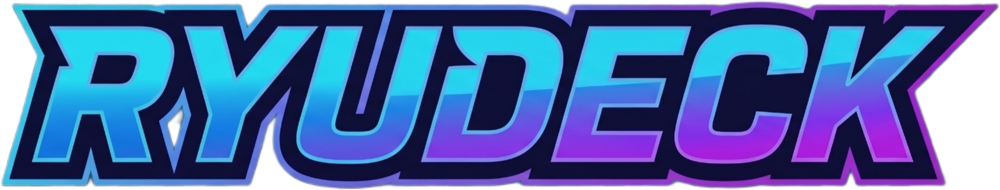
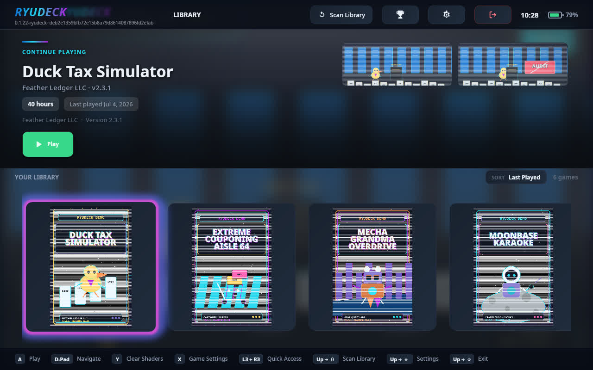
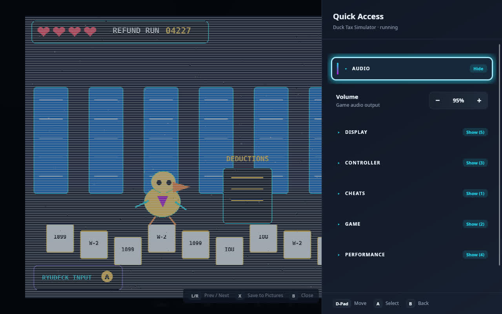
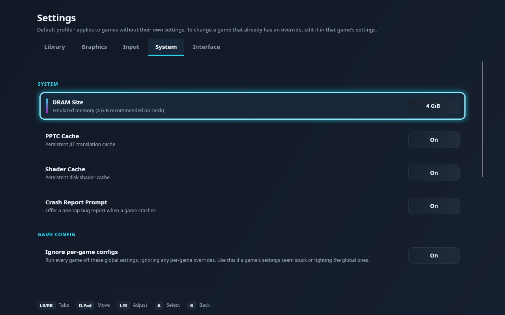

<p align="center"></p>

# Ryudeck

Ryudeck is a Steam Deck-native Switch game backup reader built for one hardware and software
stack: the Deck's Aerith APU, Mesa RADV, Gamescope, and Steam Input. It uses a Vulkan/SPIR-V-only
renderer and a controller-first interface designed for Game Mode.

Ryudeck is in active development. Compatibility varies by game, and a title reaching its menu is
not treated as playable.

> Ryudeck does not include games, firmware, or encryption keys. Use dumps from hardware and games
> you own.

<p align="center">
  
  
  
</p>

<sub>The screenshots use Ryudeck's included demo library. No commercial game artwork is included.</sub>

## Install

Download the latest self-contained archive from [GitHub Releases](https://github.com/deucebucket/ryudeck/releases/latest).
No separate .NET installation is required.

```bash
tar -xzf ryudeck-*-linux_x64.tar.gz
cd Ryudeck
./install.sh
./add-to-steam.sh --exe "$HOME/.local/share/ryudeck/Ryudeck.sh" --yes
```

The installer places Ryudeck in `~/.local/share/ryudeck`. Restart Steam after adding the shortcut,
then launch Ryudeck from Game Mode. The first-run flow imports your own keys and firmware and lets
you add a game directory.

Existing installs can run the new `install.sh` over the same location. The installer replaces the
old program files while keeping configuration, saves, keys, firmware, and shader caches.

## v0.1.24

v0.1.24 restores Tomodachi Life's grass rendering and has been checked in foreground Game Mode
against the Pokken Tournament DX regression guard.

- **Nearby Decks:** pull your game backups between paired Steam Decks on the same network. Pairing is
  required on both Decks. Downloads run in the background, resume after interruptions, verify before
  entering the library, and never propagate deletions. Sharing is off by default and each game can be
  hidden separately.
- **Friends:** give each console a nickname, pair Decks by checking their displayed codes, and see
  their local presence. Pair requests show a notification, and active transfers remain visible in
  the launcher status area. Keys, firmware, saves, and files outside configured game folders are
  never offered.
- **Cleaner launcher:** Scan Library, Achievements, Mii Creator, Nearby Decks, Friends, Settings,
  and Exit now live in one controller-navigable Menu.
- **Game fixes:** Princess Peach: Showtime! plays past its former loading blocker. Fantasy Life i
  now reaches controllable handheld gameplay, but still has severe frame-rate problems and texture
  popping. Tomodachi Life's blocky grass regression is fixed.
- **Safer defaults:** unvalidated titles no longer inherit global Frame Generation blindly, GPU
  synchronization is stricter, and Vulkan format faults no longer take down the session.
- **Useful logs:** game logs include the game name and title ID in the filename.

See the [full v0.1.24 release notes](CHANGELOG.md#v0124-2026-07-15) for the complete list and known
limitations.

## Using Nearby Decks

Nearby Decks copies game backup files between Ryudeck installs on the same local network. It is a
pull-only copy: the receiving Deck chooses a game, downloads it into its own library, and keeps its
own copy. It does not stream games or mirror deletions.

Automatic discovery currently requires both Decks on the same broadcast LAN. A routed VPN, subnet
router, or separate VLAN can make addresses reachable without carrying Nearby Decks discovery.

1. On each Deck, open **Settings > System > Network** and set a recognizable **Deck nickname**. Leave
   it blank to use the local Steam display name, then the device hostname.
2. Enable **Share library on LAN** on both Decks during setup. Open **Nearby Decks** on both, select
   the other Deck, compare the displayed friend codes, and pair on each side. Pairing is required.
3. The receiving Deck can turn sharing back off after both sides are paired. Open the paired sending
   Deck in **Nearby Decks**, select a game, and choose **Download**. You can leave the screen while the
   transfer runs.
4. After the signed hash check passes, Ryudeck moves the completed file into the first writable game
   folder and refreshes the library.

Interrupted downloads retain their partial file and resume when the sender is available again.
Transfers run one at a time. The sender must keep Ryudeck running with sharing enabled. See the
[Nearby Decks guide](docs/nearby-decks.md) for security boundaries, per-game controls, and current
scope.

## Deck-native features

- Vulkan and SPIR-V only, tuned for RADV on the Deck's RDNA 2 GPU.
- Game Mode launcher, gamepad-driven setup and settings, in-game Quick Access blade, and built-in
  on-screen keyboard.
- Native Deck touchscreen input and optional six-axis motion input.
- Per-game console mode, performance settings, boost profiles, cheats, Mii data, and crash history.
- Frame Generation and Turbo controls for titles that can use them safely.
- Suspend/resume recovery, Deck-aware thread scheduling, and unified-memory tuning.

## Compatibility

The bundled [Steam Deck compatibility list](docs/compatibility.csv) now contains only titles with
Ryudeck-specific on-device evidence. It no longer imports generic Windows, macOS, OpenGL, NVIDIA,
or Intel results from another emulator.

- **Playable:** normal gameplay is available without a known release-blocking issue.
- **In-game:** controllable gameplay is reached, but a significant issue remains.
- **Menus/Boots:** not a gameplay claim.

Current known blockers include Pokemon Legends: Z-A, Super Mario Galaxy 2, and Metroid Prime 4:
Beyond. Super Mario Galaxy reaches gameplay but runs in slow motion. Fantasy Life i and both Galaxy
titles are not listed as playable. Tomodachi Life is playable again after the grass fix.

## Project scope

Ryudeck targets Steam Deck only. Windows, macOS, other Linux handhelds, OpenGL, and non-RADV GPU
paths are outside the project scope.

Ryudeck began as a fork of Ryujinx and retains its MIT license. It no longer tracks or merges from
Ryujinx. See `LICENSE.txt` and `THIRDPARTY.md` for license and attribution details.

Nintendo Switch is a trademark of Nintendo. Ryudeck is not affiliated with, authorized by, or
endorsed by Nintendo.
